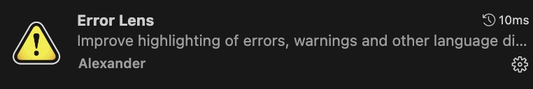
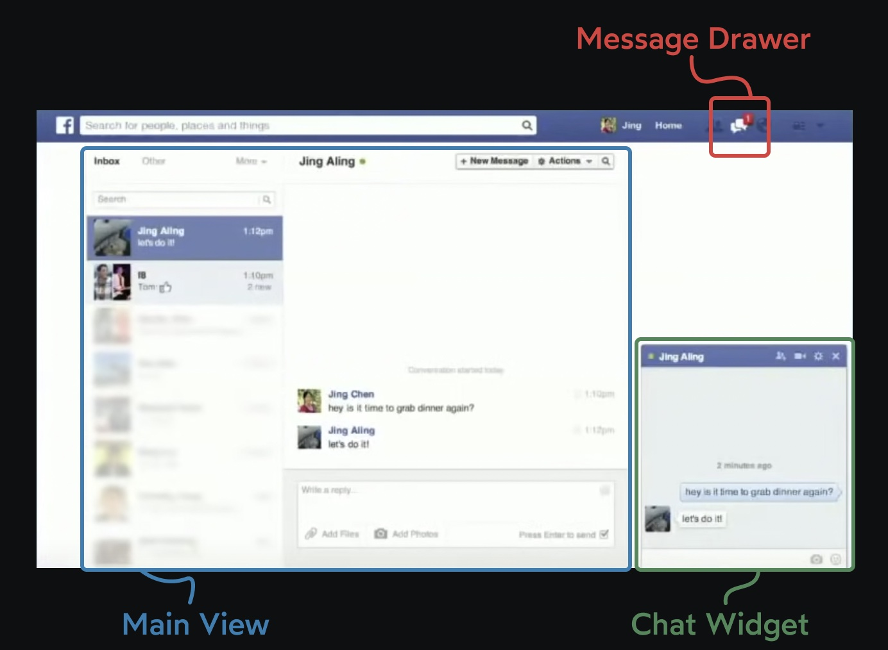
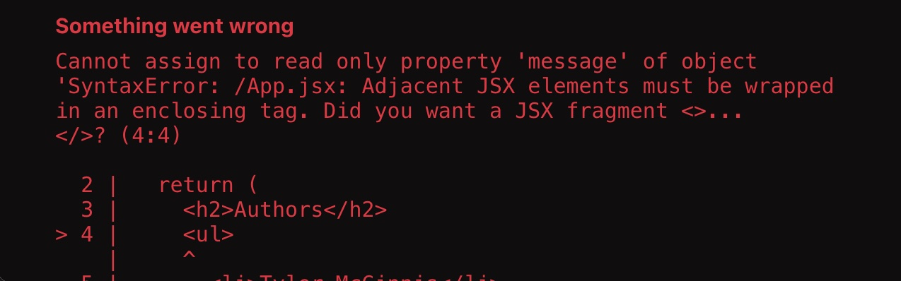

# Khóa học Front-end ATT Lab - ReactJS

### Tổng quan 🎯
1. Cài đặt các extensions cần thiết
2. Lịch sử ra đời của ReactJS
3. ReactJS là gì?
4. Hello ReactJS
5. JSX là gì?

---


<div style="page-break-after: always;"></div>

## 1. Cài đặt các extensions cần thiết





<div style="page-break-after: always;"></div>

## 2. Lịch sử ra đời của ReactJS 
Trong những năm đầu 2010, các nhà phát triển Facebook đã gặp phải một vấn đề lớn. Hàng nghìn người dùng đã phàn nàn về **"tin nhắn ma"**.

Người dùng thấy một biểu tượng thông báo nhỏ xuất hiện bên cạnh biểu tượng "tin nhắn", ám chỉ rằng họ có tin nhắn mới. Tuy nhiên, khi họ nhấp vào biểu tượng, không có tin nhắn mới nào xuất hiện, chỉ toàn là các tin nhắn cũ.

Vào thời điểm đó, giao diện người dùng của Facebook có 3 vị trí riêng biệt để hiển thị trạng thái tin nhắn:



Người dùng gặp phải vấn đề tin nhắn ma vì ba phần của giao diện này được cung cấp bởi các chế độ xem khác nhau, và các chế độ xem này đã mất đồng bộ.

Mặc dù có vẻ như đây chỉ là một vấn đề nhỏ, nhưng Facebook là một ứng dụng vô cùng phức tạp, với hàng trăm nhà phát triển thuộc hàng chục nhóm khác nhau làm việc cùng nhau, thêm tính năng mới, di chuyển nhanh và gặp nhiều vấn đề. Mỗi tuần, nhiều trường hợp mới của vấn đề này lại xuất hiện, dẫn đến hiện tượng tin nhắn ma. Điều này giống như trò chơi đập chuột; mỗi khi họ sửa được một lỗi, một lỗi mới lại xuất hiện.

Cuối cùng, nhóm phát triển đã giải quyết được vấn đề này bằng cách chuyển sang sử dụng một công cụ nội bộ mới là React. Vấn đề này, cùng với nhiều vấn đề khác, đã biến mất.


<div style="page-break-after: always;"></div>

## 3. ReactJS là gì?
> A JavaScript **library** for building user interfaces

ReactJS là một opensource được phát triển bởi Facebook, ra mắt vào năm 2013, ReactJS tập trung vào việc xây dựng giao diện người dùng (ReactJS không phải là 1 framework nên code ReactJS **rất dynamic**)


<div style="page-break-after: always;"></div>

## 4. Hello ReactJS
Hãy bắt đầu với ứng dụng React “hello world”, sử dụng JavaScript thuần túy

```jsx
// 1. Import dependencies
import React from 'react';
import { createRoot } from 'react-dom/client';

// 2. Create a React element
const element = React.createElement(
    'p',
    { id: 'hello' },
    'Hello World!'
);

// 3. Render the application
const container = document.querySelector('#root');
const root = createRoot(container);
root.render(element);
```

### 4.1. Import dependencies
```jsx
import React from 'react';
import { createRoot } from 'react-dom/client';
```

Ở đầu tệp, chúng ta có hai câu lệnh import, sử dụng hệ thống mô-đun JavaScript nguyên thuỷ. Chúng ta đang nhập thư viện React cốt lõi từ gói phụ thuộc react, cũng như một hàm `createRoot` từ `react-dom`.

Nếu bạn tự hỏi tại sao có hai gói riêng biệt, điều này là vì React chính nó là `"không phụ thuộc vào nền tảng" (“platform agnostic”)`. Chúng ta có gói `react` cốt lõi, và sau đó là các trình kết xuất cụ thể cho từng nền tảng:

- react-dom cho web
- react-native cho ứng dụng di động (iOS / Android) hoặc desktop (Windows / macOS)
- react-three-fiber cho các cảnh 3D sử dụng WebGL và Three.js

Mỗi nền tảng đều có "nguyên tố cơ bản" riêng, bộ các phần tử tích hợp mà chúng ta sử dụng để tạo giao diện người dùng của mình. 

Trên web, các nguyên tố cơ bản là các phần tử HTML như `<div>` và `<p>` và `<button>`. Ngược lại, `React Native` không có các phần tử div, nó có `Text` và `View` và `Pressable`. Và mọi thứ trở nên hỗn loạn hơn với `react-three-fiber`, nơi các nguyên tố cơ bản là các thứ như đèn, hình học, vật liệu và máy ảnh.

Tất cả các nền tảng này sẽ sử dụng cùng một framework React cốt lõi, đến từ gói react. Nhưng khi đến việc biến tất cả logic kinh doanh thành giao diện người dùng thực sự, chúng ta cần các kết nối chính xác cho nền tảng của mình.

> ✅ Vì vậy khi học ReactJS bạn có rất nhiều lựa chọn trong career path của mình

### 4.2. Cách tạo 1 React element
Tiếp theo trong ứng dụng nhỏ của chúng ta, chúng ta có đoạn mã sau:

```jsx 
const element = React.createElement(
  'p',
  { id: 'hello' },
  'Hello World!'
);
```

`React.createElement` là một hàm chấp nhận 3 hoặc nhiều hơn các đối số:

- Loại của phần tử cần tạo.
- Các thuộc tính mà chúng ta muốn phần tử này có.
- Nội dung của phần tử, cái mà phần tử này nên có như là các con.

Hàm này trả về một `"React element"`. `React element` là các đối tượng JavaScript thông thường. Nếu chúng ta kiểm tra nó với console.log(element), chúng ta sẽ thấy một cái gì đó như thế này:

```jsx
{
  type: "p",
  key: null,
  ref: null,
  props: {
    id: 'hello',
    children: 'Hello World!',
  },
  _owner: null,
  _store: { validated: false }
}
```

Đối tượng JavaScript này là một mô tả về một thẻ đoạn giả định, có một ID là hello, chứa văn bản "Hello World!". Thông tin này sẽ được sử dụng để xây dựng đoạn thực tế mà chúng ta có thể nhìn thấy trong trình duyệt.

> Sau này trong khóa học này, chúng ta sẽ tìm hiểu về key và ref. Hai thuộc tính cuối cùng, _owner và _store, được dùng để sử dụng nội bộ bởi React, và có thể được bỏ qua an toàn bởi chúng ta.

### 4.3. Render application
```jsx
const container = document.querySelector('#root');
const root = createRoot(container);
root.render(element);
```

<div style="page-break-after: always;"></div>

## 5. JSX là gì?
Chúng ta xét khai báo biến như sau :

```jsx
const element = <h1>Hello, world!</h1>;
```

Cú pháp thẻ này không phải là một chuỗi hay là HTML. Nó được gọi là `JSX`, và nó là một cú pháp mở rộng cho JavaScript. Facebook sử dụng JSX để biểu thị UI components

>JSX = Javascript + XML. Nó transform cú pháp dạng gần như XML về thành Javascript. Giúp người lập trình có thể code ReactJS bằng cú pháp của XML thay vì sử dụng Javascript. Các XML elements, attributes và children được chuyển đổi thành các đối số truyền vào React.createElement.

Vậy javascript thì hầu như ai cũng biết rồi vậy cùng nhắc lại xml và cú pháp của xml nhé

> XML là viết tắt của từ eXtensible Markup Language, hay còn gọi là ngôn ngữ đánh dấu mở rộng do W3C đề nghị với mục đích tạo ra các ngôn ngữ đánh dấu khác. Đây là một tập hợp con đơn giản có thể mô tả nhiều loại dữ liệu khác nhau nên rất hữu ích trong việc chia sẻ dữ liệu giữa các hệ thống. Điển hình nhất là ngôn ngữ đánh dấu siêu văn bản HTML sử dụng cú pháp của XML để tạo nên và nó có các bộ phần tử và thuộc tính không mềm dẻo nên chỉ có tác dụng trong việc trình bày dữ liệu trên trình duyệt Browser.

Cú pháp của tài liệu XML XML được xây dựng dựa vào cấu trúc NODE lồng nhau, mỗi node sẽ có một thẻ mở và một thẻ đóng như sau:

```jsx
<nodename>content</nodename>
```

Trong đó:

- `<nodename>`: là thẻ mở, tên của thẻ này do bạn tự định nghĩa.
- `</nodename>`: là thẻ đóng, tên của thẻ này phải trùng với tên của thẻ mở.
- content: là nội dung của thẻ này

### 5.1. Cách triển khai 1 JSX
Nhìn chung, viết JSX sẽ cảm thấy khá tự nhiên. Đa số chỉ giống như HTML, nhưng có một số điều cần lưu ý.

<div style="page-break-after: always;"></div>

#### 5.1.1. Cách viết JSX nhiều dòng
Đầu tiên, hãy nói về việc có nhiều dòng JSX.

Cho đến nay, khi chúng ta có nhiều phần tử trong JSX của chúng ta, chúng ta đã làm điều này - trong đó phần tử đầu tiên ngay lập tức tiếp theo lệnh return và các phần còn lại được thụt vào một cách bình thường trên các dòng mới.

```jsx
export default function WhatIsJSX () {
  return <main>
    <h1>This is JSX</h1>
    <h2>JSX <i>looks</i> like HTML</h2>
    <h4>(but it's not)</h4>
    <p>
      JSX is inspired by HTML and allows you to
      write HTML-ish looking syntax inside your
      React Components.
    </p>
  </main>
}
```

Mặc dù điều đó hoạt động, thực sự là hơi lạ. Cụ thể, là phần tử `<main>` đầu tiên làm cho mọi thứ trở nên khác thường. Chúng ta sẽ không bao giờ viết HTML với phần tử đầu tiên được thụt vào nhiều hơn so với các phần tử con của nó, vậy tại sao làm như vậy ở đây?

Để khắc phục điều này, bạn có thể cảm thấy muốn làm điều này (cảm giác tự nhiên hơn).

```jsx
export default function WhatIsJSX () {
  return 
    <main>
      <h1>This is JSX</h1>
      <h2>JSX <i>looks</i> like HTML</h2>
      <h4>(but it's not)</h4>
      <p>
        JSX is inspired by HTML and allows you to
        write HTML-ish looking syntax inside your
        React Components.
      </p>
    </main>
}
```

Rất tiếc, như bạn có thể thấy, điều đó sẽ không hoạt động. Đó là một điều đặc biệt trong đặc tả JavaScript. Khi trình thông dịch JavaScript chạy mã này, do việc chèn dấu chấm phẩy tự động (ASI), nó sẽ chèn một dấu chấm phẩy ngay sau lệnh return của chúng ta - kết thúc hàm và không trả về gì cả, như thế này.

```jsx
export default function WhatIsJSX () {
  return;
    // <main>
    //   <h1>This is JSX</h1>
    //   <h2>JSX <i>looks</i> like HTML</h2>
    //   <h4>(but it's not)</h4>
    //   <p>
    //     JSX is inspired by HTML and allows you to
    //     write HTML-ish looking syntax inside your
    //     React Components.
    //   </p>
    // </main>
}
```

Cách chuẩn để khắc phục điều này là bọc JSX của bạn trong dấu ngoặc đơn (), cho phép chúng ta có JSX được thụt vào như bạn mong đợi, đồng thời tránh các vấn đề ASI.

```jsx
export default function WhatIsJSX () {
  return (
    <main>
      <h1>This is JSX</h1>
      <h2>JSX <i>looks</i> like HTML</h2>
      <h4>(but it's not)</h4>
      <p>
        JSX is inspired by HTML and allows you to
        write HTML-ish looking syntax inside your
        React Components.
      </p>
    </main>
  )
}
```

> Cùng xem đoạn code dưới đây có chỗ nào không hợp lí không?
```jsx
export default function Authors () {
  return (
    <h2>Authors</h2>
    <ul>
      <li>Tyler McGinnis</li>
      <li>Ben Adam</li>
      <li>Alex Brown</li>
    </ul>
  )
}
```
Rất tiếc, chúng ta sẽ gặp lỗi sau đây


<div style="page-break-after: always;"></div>

Cách fix
```jsx
export default function Authors () {
  return (
    <div>
      <h2>Authors</h2>
      <ul>
        <li>Tyler McGinnis</li>
        <li>Ben Adam</li>
        <li>Alex Brown</li>
      </ul>
    </div>
  )
}
```
Cách tối ưu hơn
```jsx
import * as React from "react"

export default function Authors () {
  // Cách 1
  return (
    <React.Fragment>
      <h2>Authors</h2>
      <ul>
        <li>Tyler McGinnis</li>
        <li>Ben Adam</li>
        <li>Alex Brown</li>
      </ul>
    </React.Fragment>
  )

  // Cách 2 (Recommend)
  return (
    <>
      <h2>Authors</h2>
      <ul>
        <li>Tyler McGinnis</li>
        <li>Ben Adam</li>
        <li>Alex Brown</li>
      </ul>
    </>
  )
}
```

<div style="page-break-after: always;"></div>

#### 5.1.2. Cách làm việc với thẻ tự đóng trong JSX
Hãy xem có gì không ổn với JSX này?

```jsx
function Form () {
  return (
    <form method="get" action="/search">
      
      <br>
      <label>
        Tìm kiếm
        <input name="term" type="text">
      </label>
      <button type="submit">Tìm kiếm</button>
    </form>
  )
}
```

Nếu bạn quen với HTML nhưng mới làm quen với React, câu trả lời của bạn có lẽ là "... không gì cả?" Đây là một trường hợp khác nơi JSX khác một chút so với HTML. Khi bạn có một "Thẻ tự đóng" (phổ biến nhất là input, br và img), bạn cần đảm bảo rằng bạn đóng chúng một cách rõ ràng.

```jsx
<input> 👎
<input /> 👍

<br> 👎
<br /> 👍

 👎
 👍
```

Vì vậy, với điều đó, thành phần Form của chúng ta sẽ có JSX hợp lệ nếu chúng ta đóng tất cả các phần tử tự đóng của mình một cách rõ ràng.

```jsx
function Form () {
  return (
    <form method="get" action="/search">
      
      <br />
      <label>
        Tìm kiếm
        <input name="term" type="text" />
      </label>
      <button type="submit">Tìm kiếm</button>
    </form>
  )
}
```

Còn với cái này thì sao? Bạn có thể nhận ra điều gì không ổn với JSX này không?

```jsx
function Avatar () {
  return (
    
  )
}
```

Tôi biết, đây là một trường hợp lạ. Lỗi ở chỗ là `class` phải là `className`.

```jsx
function Avatar () {
  return (
    
  )
}
```

> Lý do cho điều này là vì cuối cùng JSX này sẽ được chuyển đổi thành JavaScript và trong JavaScript, có những từ khóa cụ thể được định nghĩa sẳn (có nghĩa là bạn không thể sử dụng chúng). class chỉ tình cờ là một trong số đó.

Một điều tương tự cần chú ý là bạn không thể sử dụng tên biến có dấu gạch ngang. Vì vậy, bất kỳ thuộc tính HTML thông thường nào có dấu gạch ngang (như stroke-width) bạn cần chuyển đổi thành dạng camelCase.

```jsx
function Icon () {
  return (
    <svg width="200" height="200">
      <rect
        x="10"
        y="10"
        width="180"
        height="180"
        fill="none"
        stroke="black"
        strokeWidth="5"
      />
    </svg>
  )
}
```

Khi bạn muốn sử dụng một biểu thức (một cái gì đó tạo ra một giá trị) trong JSX, bạn cần bọc biểu thức trong dấu ngoặc nhọn `{}`.

```jsx
function Welcome {
  const name = 'Tyler'

  return (
    <div>
      <h1>Hello, {name}</h1>
      <p>
        Hôm nay là {new Date().toLocaleDateString()}
      </p>
      <p>2 + 2 bằng bao nhiêu? {2 + 2}</p>
    </div>
  )
}
```

Nếu bạn muốn một thành phần React không hiển thị gì, như đôi khi là khi dữ liệu vẫn đang tải, hãy trả về null từ thành phần của bạn.

```jsx
if (isLoading() === true) {
  return null
}

return (
  <main>
    <h1>This is JSX</h1>
    <h2>JSX <i>looks</i> like HTML</h2>
  </main>
)
```

<div style="page-break-after: always;"></div>

#### 5.1.3. Conditional rendering.
Tiếp theo là việc hiển thị điều kiện.

Khả năng hiển thị giao diện người dùng dựa trên một phần của trạng thái là khá cơ bản đối với bất kỳ framework front-end nào. Thông thường, chức năng này được tích hợp sẵn vào framework.

```jsx
// Angular
<h1 *ngIf="authed; else elseBlock">Welcome back!</h1>
<ng-template #elseBlock>
  <h1>Login to see your dashboard</h1>
</ng-template>

// Vue
<h1 v-if="authed">Welcome back!</h1>
<h1 v-else>Login to see your dashboard</h1>
```

React thì khác một chút

Thay vì mở rộng lớp API, do JSX chỉ là JavaScript, React có thể tận dụng các tính năng JavaScript sẵn có để hoàn thành cùng một nhiệm vụ. Cách tiếp cận này có ưu nhược điểm, nhưng nếu bạn đã quen thuộc với việc hiển thị điều kiện trong JavaScript, bạn sẽ cảm thấy khá thoải mái.

Ví dụ đơn giản nhất là sử dụng câu lệnh if/else.

```jsx
function Dashboard () {
  const authed = isAuthed()
  const firstLogin = isNew()

  if (firstLogin === true) {
    return <h1>👋 Welcome!</h1>
  } else if (authed === true) {
    return <h1>Welcome back!</h1>
  } else {
    return  <h1>Login to see your dashboard</h1>
  }
}
```

Nếu bạn đang hiển thị giao diện người dùng khác nhau dựa trên một điều kiện duy nhất, thông thường bạn sẽ sử dụng toán tử ternary của JavaScript.
```jsx
// C1
function Dashboard () {
  return isAuthed() === true
    ? <h1>Welcome back!</h1>
    : <h1>Login to see your dashboard</h1>
}

// C2
function Dashboard () {
  return (
    <React.Fragment>
      <Logo />
      {isAuthed() === true
        ? <h1>Welcome back!</h1>
        : <h1>Login to see your dashboard</h1>}
    </React.Fragment>
  )
}
```

Trước đó chúng ta cũng đã biết rằng chúng ta có thể trả về `null` nếu muốn React không hiển thị gì. Đây là một mô hình phổ biến khi sử dụng chim nhạn.
```jsx
function Dashboard () {
  // C1
  return (
    <React.Fragment>
      <Logo />
      {showWarning() === true
        ? <Warning />
        : null}
    </React.Fragment>
  )

  // C2
  return (
    <React.Fragment>
      <Logo />
      {showWarning() === true && <Warning />}
    </React.Fragment>
  )
}
```

#### 5.1.4. Cách render 1 list item trong ReactJS
```jsx
const tweets = [
  {
    id: 1,
    stars: 13,
    text: 'Turns out git reset --hard HEAD^ was a terrible idea',
  },
  {
    id: 3,
    stars: 51,
    text: "Clean code is subjective. Optimize for deletion",
  },
  {
    id: 4,
    stars: 19,
    text: "What even is a jQuery?",
  },
]

const danhSachTweet = tweets.map((tweet) =>
  `<li>${tweet.text}</li>`
) 
```

Tuy nhiên, khi sử dụng `.map` trong React để tạo danh sách, bạn cần đảm bảo mỗi phần tử trong danh sách có **một key duy nhất**. Điều này giúp React hiểu được `Element` nào thay đổi, nếu có, qua các lần render khác nhau của `Component` đó.

> Việc cung cấp key prop duy nhất cho mỗi phần tử trong danh sách giúp React tối ưu hóa quá trình render, và đảm bảo rằng các phần tử được render lại đúng cách mỗi khi có sự thay đổi.

<div style="page-break-after: always;"></div>

## Bài tập
1. https://codesandbox.io/p/sandbox/buoi-1-bt01-l6q5p9
2. https://codesandbox.io/p/sandbox/buoi1-bt02-5rs6vw

## Links tham khảo
- https://www.joshwcomeau.com/
- https://viblo.asia/p/tong-quan-ve-jsx-Qbq5QqBL5D8