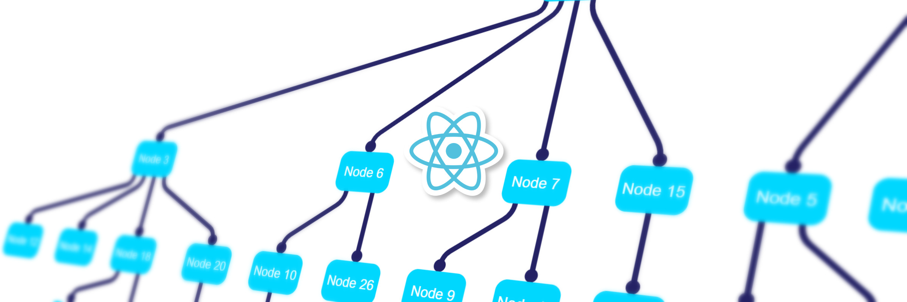
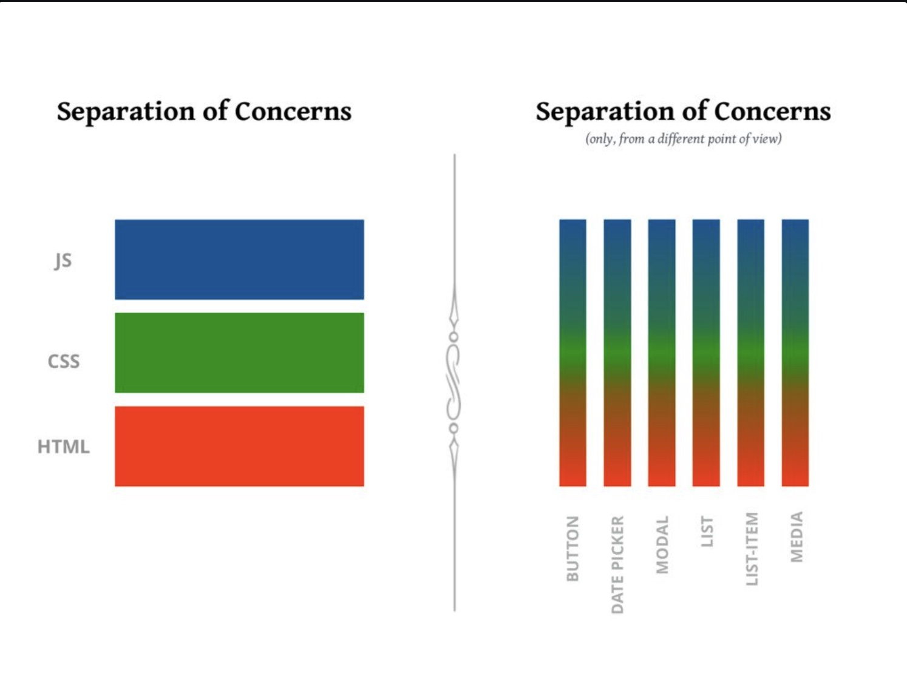
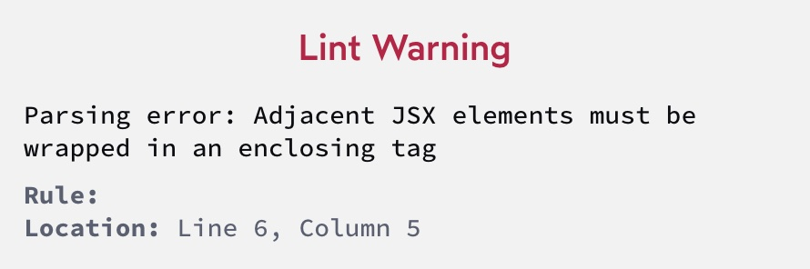

# Khóa học Front-end ATT Lab - ReactJS

### Tổng quan 🎯
1. Tìm hiểu về khái niệm Component
2. Props là gì?
3. Fragment là thẻ gì?
4. Làm việc với mảng

---



<div style="page-break-after: always;"></div>

## 1. Tìm hiểu về khái niệm Component
Các `Component` là một **phần rất lớn** của React. Nếu bạn chỉ biết một điều về React thì có lẽ bạn cũng biết đó là một framework dựa trên `Component`.

Chính xác thì một `Component` là gì? Một `Component` là một tập hợp các `markup (HTML), styles (CSS) và logic (JS)` kiểm soát mọi thứ về một phần cụ thể của giao diện người dùng.

Đó là một mô hình tinh thần khác khi nói đến tổ chức mã. Thay vì tách ứng dụng của chúng ta thành markup (viết bằng HTML), styles (viết bằng CSS) và logic (viết bằng JS), chúng ta tổ chức ứng dụng của mình thành các thành phần.

Có một hình ảnh đáng yêu mà minh nghĩ sẽ minh họa điều này rất rõ:



<div style="page-break-after: always;"></div>

### 1.1. Cơ chế tái sử dụng
HTML truyền thống thực sự không có cách nào để sử dụng lại các phần markup. Chúng ta phải copy và lặp lại đoạn code đó ở rất nhiều nơi (khi 1 chỗ cần thay đổi, chúng ta phải tìm các chỗ khác để update theo)

Trong CSS, cơ chế chính mà chúng ta có để tái sử dụng là `class`. Ví dụ: chúng ta có thể tạo kiểu “btn” tiêu chuẩn, trong class `btn`:

```css
.btn {
  padding: 8px 32px;
  background: blue;
  border: none;
  font-size: 1rem;
}
```

Bất cứ khi nào chúng ta muốn áp dụng bộ kiểu này cho một phần tử HTML, chúng ta có thể đưa lớp btn vào đó.

Và đối với JavaScript, cơ chế tái sử dụng chính là hàm. Có lẽ chúng ta có một chức năng xử lý dữ liệu theo một cách nào đó:
```js
function upperCaseWord(sentence) {
  return sentence.toUpperCase() + '!!';
}

upperCaseWord("Hello world")
// -> "HELLO WORLD!!"
```

Với React, các `Component` là cơ chế tái sử dụng chính. Thay vì các phần dành cho HTML, các lớp dành cho CSS và các hàm dành cho JavaScript, chúng ta tạo một `Component` kết hợp cả 3 thành phần đó và cho phép chúng ta tạo một thư viện gồm các phần tử giao diện người dùng có thể tái sử dụng nâng cao.

Ý tưởng này thực sự rất mạnh mẽ. Phải mất một thời gian để làm quen với việc suy nghĩ về các thành phần, nhưng một khi đã làm được điều đó, bạn sẽ không bao giờ muốn làm việc trên một dự án mà không có chúng.

> React hiện đại cũng có tính năng hook, cung cấp một cách để sử dụng lại logic React! Chúng ta sẽ tìm hiểu tất cả về chúng trong các mô-đun phía trước.

<div style="page-break-after: always;"></div>

## 2. Props là gì?
- Props là data được truyền từ `component cha xuống component con`
- Props là thuộc tính `READ-ONLY`, component con không thay đổi được. Nếu muốn thay đổi thì phải nhờ `component cha`
- Props giúp tạo `sự đa dạng` cho component. Cùng 1 `component đó` nhưng khi truyền vào `props khác nhau` thì khi `render lên UI cũng sẽ khác nhau`


```jsx
const VideoCard = ({thumbnailUrl, title, viewCount, publishedAt}) => {
    return <div>
        <image src={thumbnailUrl} />
        <h3>{title}</h3>
        <p>
            <span>{viewCount}</span>
            <span>{publishedAt}</span>
        </p>
    </div>
}
```

### Khái niệm `defaultProps`
```jsx
const Box = ({width = '50px', height = '50px', color = 'red'}) => {
    return <div style={{
       width: width,
       height: height, 
       backgroundColor: color
    }}></div>
}
```

### Khái niệm `children prop`
Thông thường, chúng ta muốn truyền 1 đoạn text vào button thì hay làm theo cách này
```jsx
// Khai báo
function RedButton({ content }) {
  return (
    <button
      style={{
        color: 'white',
        backgroundColor: 'red',
      }}
    >
      {content}
    </button>
  );
}

// Khi sử dụng
function App() {
    return <RedButton content="Hello World" />
}
```
Nhưng có 1 cách dễ nhìn hơn cách trên
```jsx
// Khai báo
function RedButton({ children }) {
  return (
    <button
      style={{
        color: 'white',
        backgroundColor: 'red',
      }}
    >
      {children}
    </button>
  );
}

// Khi sử dụng
function App() {
    return <RedButton>Hello World</RedButton>
}

// Thực tế đoạn code trên sẽ được biến đổi như sau
function App() {
    return <RedButton children="Hello World" />
}
```

### Bài tập
> Note: Tên 1 component chữ cái bắt đầu phải viết hoa (Capitalized Case)
1. https://codesandbox.io/p/sandbox/buoi02-bt1-x7jckn
2. https://codesandbox.io/p/sandbox/buoi02-bt2-x8pqc8

## 3. Fragment là thẻ gì?
Giả sử chúng ta render ra HTML sau:
```html
<h1>Welcome to my homepage!</h1>
<p>Don't forget to sign the guestbook!</p>
```
Nhưng khi chúng ta copy/paste đoạn code trên vào thì gặp lỗi sau:
```jsx
import React from 'react';

function App() {
 return (
    <h1>Welcome to my homepage!</h1>
    <p>Don't forget to sign the guestbook!</p>
 );
}

export default App;
```


`babel` sẽ biên dịch đoạn code trên thành
```jsx
function App() {
  return (
    React.createElement('h1', {}, 'Welcome to my homepage!')
    React.createElement('p', {}, "Don't forget to sign...")
  );
}
```

Chúng ta cùng xem ví dụ sau đây để hiểu rõ hơn lỗi trên sai ở đâu
```js
function something() {
  let arr = [1, 2, 3];

  return (
    arr.push(4)
    arr.push(5)
  );
}
```
> Chỉ được return về 1 biểu thức, nhưng chúng ta đang đóng gói hai biểu thức trong đó! 

Vậy thì có cách nào để fix lỗi trên

Chúng ta có thể bọc nó bằng 1 thẻ div
```js
return (
  <div>
    <h1>Welcome to my homepage!</h1>
    <p>Don't forget to sign the guestbook!</p>
  </div>
);
```
Nhưng cách làm trên sẽ làm ô nhiễm DOM với các `element` không cần thiết. Và nó thậm chí có thể dẫn đến các vấn đề không mong muốn
```jsx
import React from 'react';

function App() {
 return (
    <ul>
        <ListItems />
        <li>Item 3</li>
        <li>Item 4</li>
    </ul>
 );
}

function ListItems() {
 return (
    <div>
        <li>Item 1</li>
        <li>Item 2</li>
    </div>
 );
}

export default App;
```

> Chúng ta có thể dùng `thẻ Fragment` để giải quyết vấn đề trên
```jsx
import React from 'react';

function App() {
 return (
    <ul>
        <ListItems />
        <li>Item 3</li>
        <li>Item 4</li>
    </ul>
 );
}

// C1
function ListItems() {
 return (
    <React.Fragment>
        <li>Item 1</li>
        <li>Item 2</li>
    </React.Fragment>
 );
}

// C2 (ngắn gọn hơn)
function ListItems() {
 return (
    <>
        <li>Item 1</li>
        <li>Item 2</li>
    </>
 );
}

export default App;
```

## 4. Làm việc với mảng
Ta cùng nhìn vào đoạn code sau, hãy cho biết nhược điểm của nó là gì?
```jsx
<ul>
  <ContactCard
    name="Sunita Kumar"
    job="Electrical Engineer"
    email="sunita.kumar@acme.co"
  />
  <ContactCard
    name="Henderson G. Sterling II"
    job="Receptionist"
    email="henderson-the-second@acme.co"
  />
  <ContactCard
    name="Aoi Kobayashi"
    job="President"
    email="kobayashi.aoi@acme.co"
  />
</ul>
```
Cùng nhau refactor lại đoạn code trên
https://codesandbox.io/p/sandbox/buoi02-bt3-4gks7g

### Lưu ý
- Có 2 cách để render 1 item trong mảng
```jsx
// C1 ✅
return (
  <ul>
    {data.map((contact) => {
      return <ContactCard
        name={contact.name}
        job={contact.job}
        email={contact.email}
      />
    })}
  </ul>
);

// C2 ✅
return (
  <ul>
    {data.map((contact) => {
      return <ContactCard
        name={contact.name}
        job={contact.job}
        email={contact.email}
      />
    })}
  </ul>
);

// Không nên dùng cách này ❌
return (
  <ul>
    {data.map((contact) => {
      <ContactCard
        name={contact.name}
        job={contact.job}
        email={contact.email}
      />
    })}
  </ul>
);
```
Bật `console` lên, lúc này ta sẽ gặp lỗi sau đây


Cách khắc phục
```jsx
return (
    <ul>
      {data.map(contact => (
        <ContactCard
          key={contact.id}
          name={contact.name}
          job={contact.job}
          email={contact.email}
        />
      ))}
    </ul>
  );
```

### Bài tập
- https://codesandbox.io/p/sandbox/solitary-leaf-dmjm86
- https://codesandbox.io/p/sandbox/kind-hermann-yjlhdd